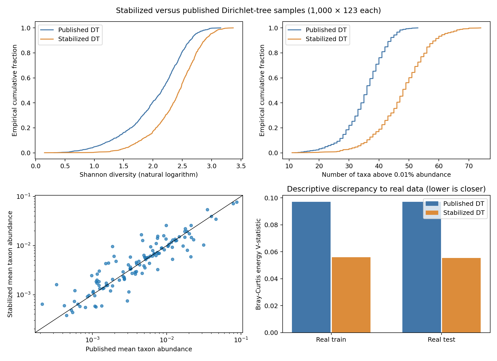
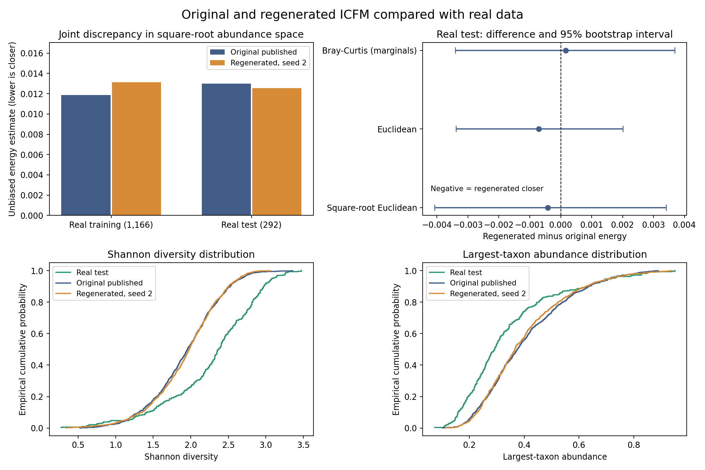

# Generative-model release: 2026-10-03

This release supplies fitting/sampling code for all four case-study generators
and the selected updated **1,000 × 123** synthetic matrices in
[`data/regenerated_20261003/`](../../data/regenerated_20261003/).

The combined regeneration command reproduced all four selected CSV files
**with identical SHA-256 checksums** in the recorded CPU environments. See
[`reproduction_checks.json`](reproduction_checks.json) and the
[workflow instructions](../../generators/README.md).

## What is reproduced

| Generator | Selected construction | Numerical reproduction |
| --- | --- | --- |
| Dirichlet | Recovered Newton MLE on the 1,166 public training rows | Exact selected CSV; maximum difference from the original paper sample `8.71e-11` |
| DT | Stabilized positive-parameter Beta MLE at 122 tree nodes | Exact selected parameters and CSV; this is an updated model, not the original unstable fit |
| ICFM | Recovered MLP checkpoint, restored torchdyn 1.0.6 sampler, CPU seed 2 | Exact selected CSV; differs from the original paper sample |
| MBGAN | Recovered HDF5 generator, equivalent TensorFlow/Keras chain, seed 256 | Exact selected CSV; maximum difference from the original paper sample `1.79e-7` |

The parameter score residuals are `1.81e-11` for Dirichlet and at most
`2.24e-14` over all 122 DT nodes. Parameter fitting reads only the public
training matrix. The original paper matrices, real splits, BATTS posterior
summaries, and previous figures are preserved.

The ICFM and MBGAN **historical training procedures are not fully recovered**.
Their bundled data are checkpoint replays. Separate new-training commands are
provided with explicit seeds, settings, preprocessing, and input hashes;
these commands do not claim to recover the historical weights. No new full
neural training run or BATTS refit was performed for this release.

## Training-code checks

- **Parametric models:** full 1,166-row fitting, score-equation verification,
  checkpoint resampling, and CSV round trips pass. See
  [`parametric_checks.json`](parametric_checks.json).
- **ICFM:** two independent short CPU training runs produce identical losses
  and parameter tensors, update the initialized weights, and sample valid
  compositions after checkpoint loading. A different tree is rejected for a
  newly trained checkpoint. See
  [`ICFM_validation.json`](../../generators/ICFM_validation.json).
- **MBGAN:** short alternating critic/generator training has finite connected
  gradients and changes both networks. Saved generator weights reproduce
  their samples on reload. Historical replay verifies all 20 saved weight
  arrays. See [`mbgan_smoke.json`](../../generators/validation/mbgan_smoke.json).

These short neural checks establish that the training code executes and
records reproducible settings; they are not convergence or adequacy studies.
The new MBGAN recipe explicitly repairs the disconnected gradient penalty in
the recovered legacy graph. Details and third-party licenses are retained in
the [MBGAN documentation](../../generators/MBGAN.md).

## DT comparison with real data

The stabilized DT has higher diversity and less dominance than the published
DT sample. Mean Shannon entropy changes from **2.048 to 2.393**, compared with
**2.286** in the public real test split. Mean largest-taxon abundance changes
from **0.388 to 0.309**, versus **0.338** in real test data.

The stabilized model also generates too many taxa above `1e-4`: **47.98** on
average, compared with **35.48** for published DT and **37.62** for real test
data. The numerical fitting correction does not remove the model's
independent-node assumptions or establish uniform improvement.



## ICFM comparison with real data

For the selected seed-2 sample, changes are small and mixed. Against the
292-row public real test split:

| Discrepancy; lower is closer | Published ICFM | Selected regenerated ICFM |
| --- | ---: | ---: |
| Square-root Euclidean energy U | 0.012974 | 0.012552 |
| Euclidean energy U | 0.011550 | 0.010844 |
| Bray-Curtis energy U | 0.019852 | 0.020018 |
| Mean-composition L1 error | 0.317438 | 0.285759 |
| Mean absolute taxon-prevalence error | 0.033566 | 0.040172 |

The primary energy difference is **−0.000423**, with 95% percentile bootstrap
interval **[−0.004070, 0.003416]**. This does not establish superiority or
equivalence. Three additional draws with the previously specified seeds
101, 102, and 103 also have smaller test joint discrepancies; training-split
rankings vary. All seeds are retained in
[`icfm_energy_by_seed.csv`](icfm_energy_by_seed.csv); no best seed is selected.

Both ICFM samples have mean Shannon entropy about **1.94**, below real test
**2.286**, and excessive mean dominance: about **40%** versus **33.85%**.
Their richness variability is also too small. See
[`icfm_feature_distances.csv`](icfm_feature_distances.csv).



## Reproduce the validation

```sh
.venv-generators/bin/python -m generators.validate --check-bundled-hashes
.venv-generators/bin/python -m generators.compare_icfm \
  --bootstrap 1000 --output output/generators/icfm_comparison
```

The first command reproduces all four generators' train/test comparisons in
[`validation/comparisons.csv`](validation/comparisons.csv). The second
reproduces the selected ICFM joint comparison and its shared-real-resample
bootstrap. Saved results and methods are in
[`icfm_joint_comparison.json`](icfm_joint_comparison.json).

All rows are normalized before distance calculations. Energy U-statistics
exclude within-sample diagonals; earlier exploratory reports used biased
V-statistics, so their absolute values differ. Square-root Euclidean distance
is `sqrt(2)` times Hellinger distance and tests joint-distribution agreement.
Bray-Curtis energy on normalized compositions is a sum of coordinatewise
energies and cannot detect dependence-only changes.

Bootstrap intervals quantify finite-cohort uncertainty conditional on fixed
generators and independent rows, not training variability. The public real
splits contain 1,166 training and 292 test observations. The historical neural
checkpoints' fitting membership is unverified, so those test observations
cannot be certified independent of the historical neural fits.
